**Website Link**

https://fervent-goldwasser-95dc4e.netlify.app 

**Github Repo**

https://github.com/hunteradams10/T1A2-portfolio-project

**Purpose**

I have created a portfolio website with a view to display my abilities as a web developer to prospective employers and other developers.

**Functionality/Features**

I've created a very simple, highly-accessible web page with a lot of CSS animations over pictures and icons to create interest and increase user experience. The website's features are as follows:

* The website features a "back-to-top" button on all pages that require scrolling

* The website and all components are responsive and will adjust to tablet and mobile views using javascript.

* Responsive navbar that will collapse into a hamburger menu for mobile and tablet views.

* High-contrast colours/shades for greater accessibility.

* Semantic HTML where possible for accessibility.

* Tab-indexing where necessary for accessibility.

* Animated image components to create interests and showcase CSS abilities.

* Appropriately styled text elements both to increase user experience and for accessibility.

* Styled, responsive footer element with image links to github and LinkedIn on each page.

**Sitemap**

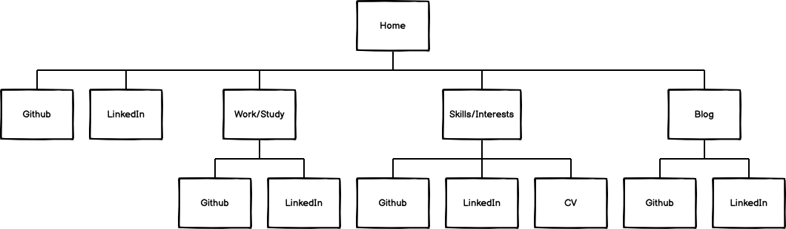

**Tech Stack**

HTML, CSS and Javascript.

**Screenshots**

(Screenshots display a large portion of the website but not the whole thing in its entirity. These are intended to showcase parts of the website. )

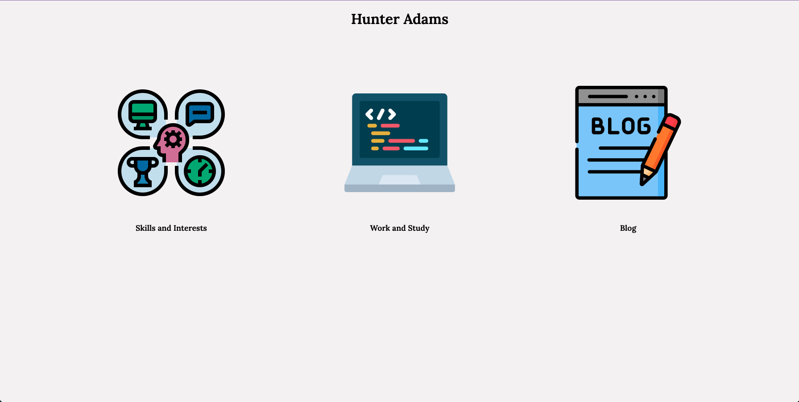

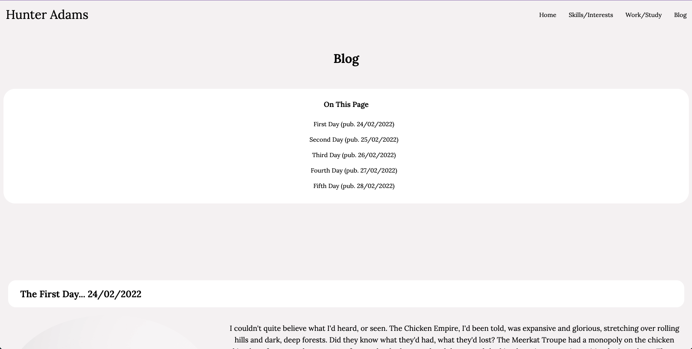

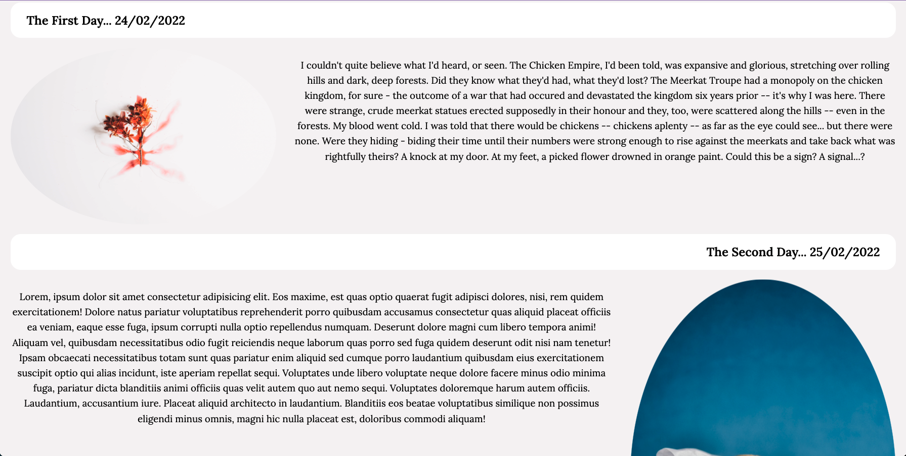

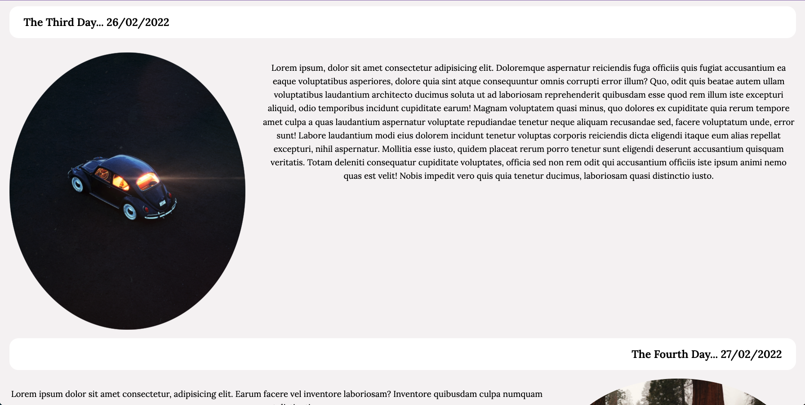

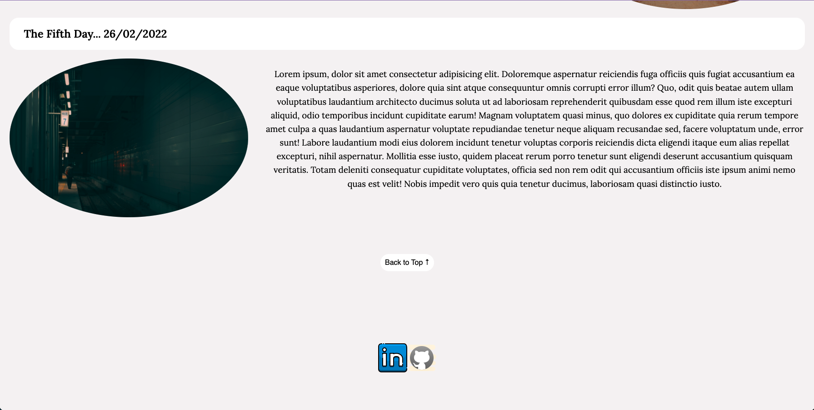

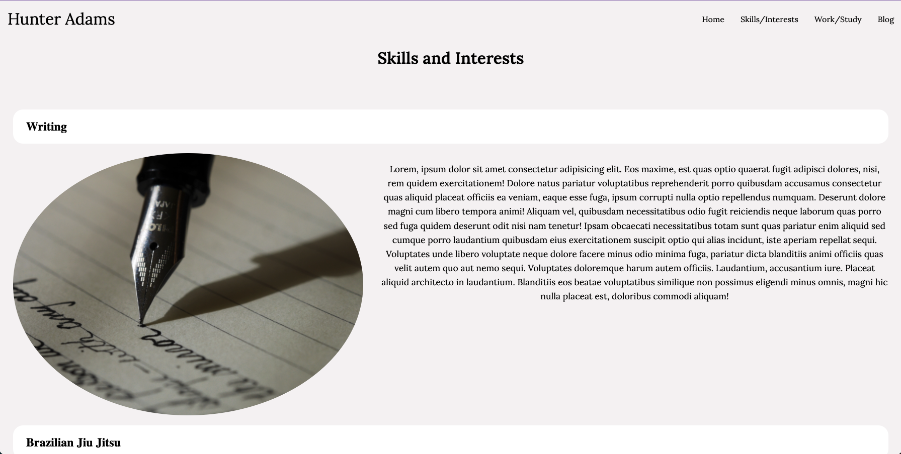

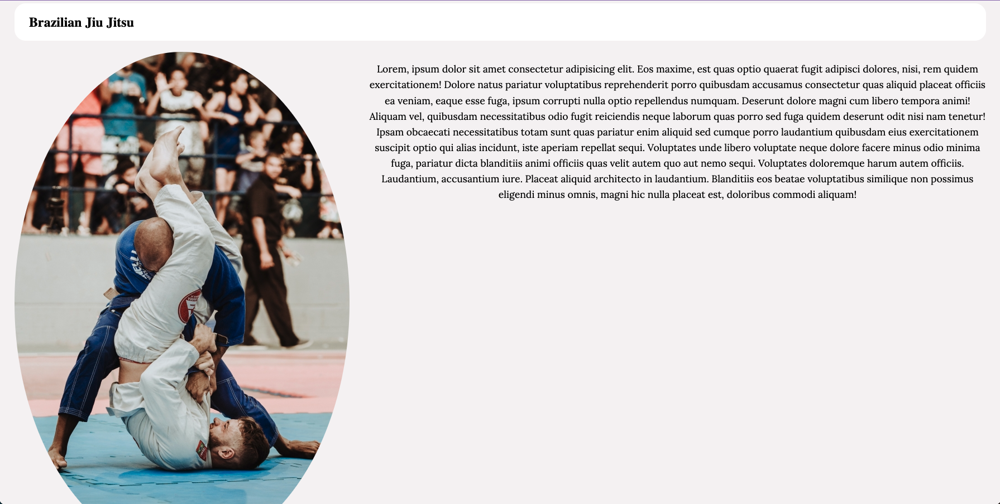

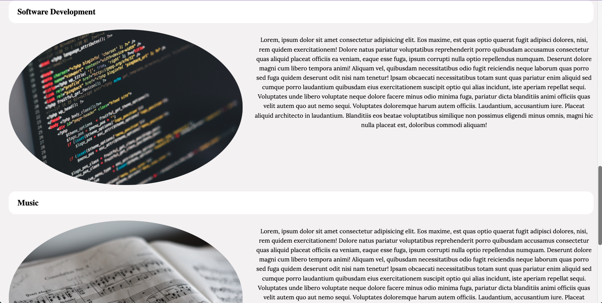

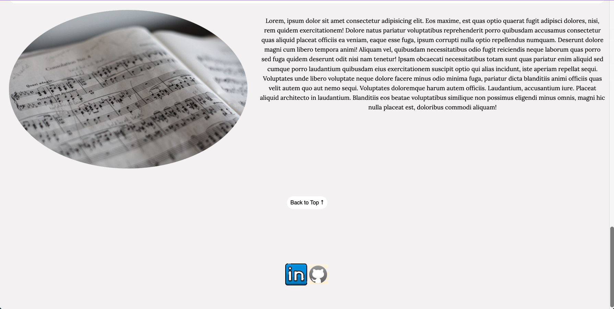

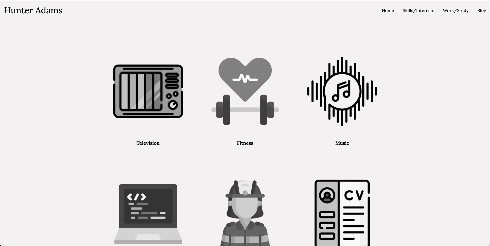

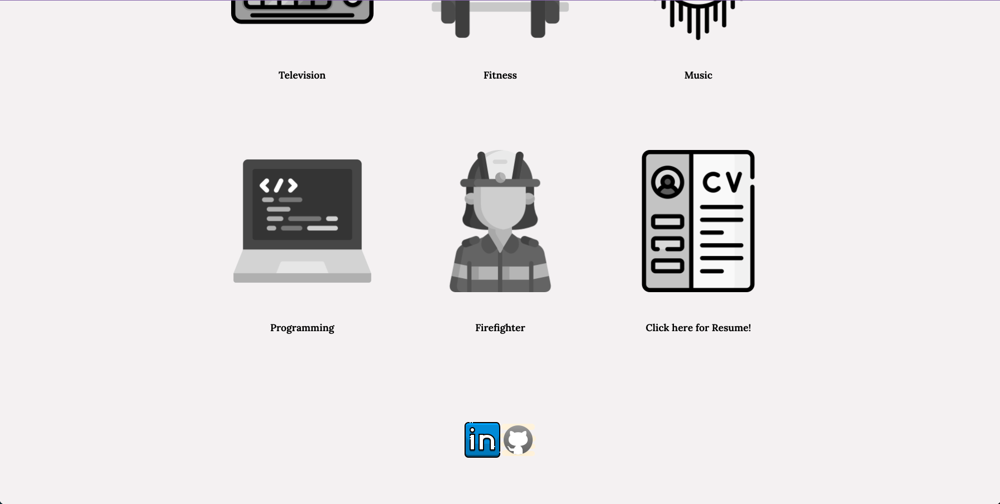

**Footer Links to Github and Linkedin:**

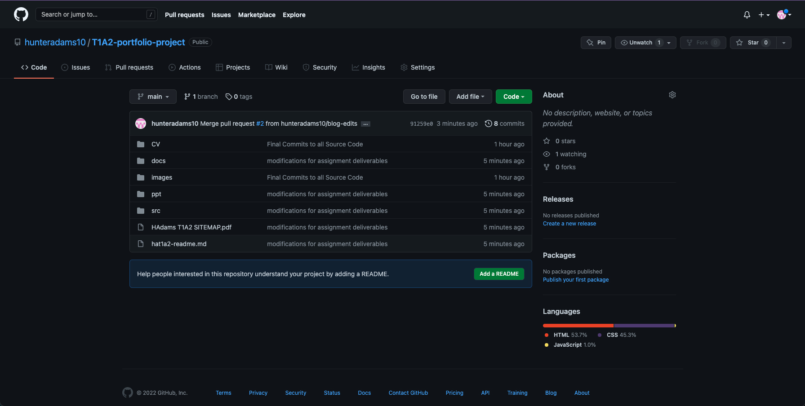

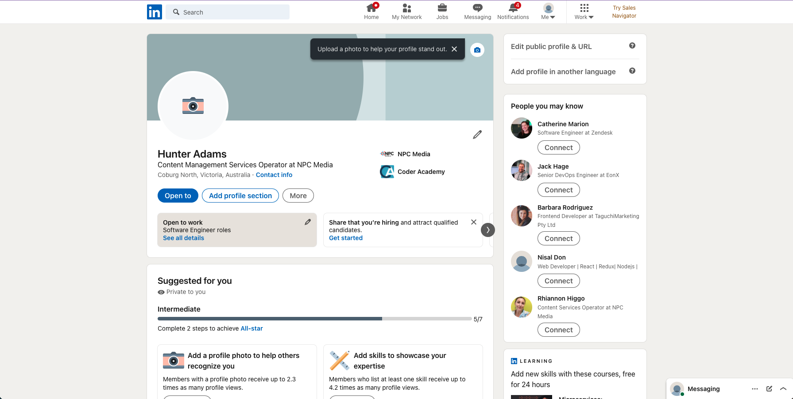